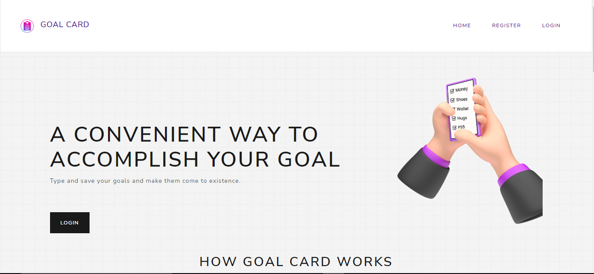

# GOAL CARD
### A CONVENIENT WAY TO ACCOMPLISH YOUR GOAL

## Clone the repository using the command below :

```bash
git clone https://github.com/patoski716/Goalcard-with-vue-django.git

```

## Move into the directory where we have the project files : 

```bash
cd Goalcard-with-vue-django

```

## Project setup
```
npm install
```

### Compiles and hot-reloads for development
```
npm run serve
```

### Compiles and minifies for production
```
npm run build
```

<div align="center">



</div>

### Customize configuration
See [Configuration Reference](https://cli.vuejs.org/config/).
